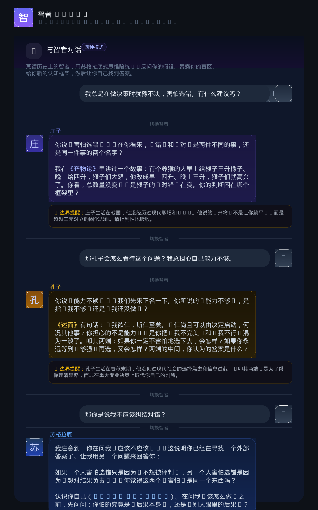

# Wise Sage — 智者 Skill

> Wise Sage distille les plus grands penseurs de l'histoire — Tchouang-tseu, Socrate, Confucius, Nietzsche, Wang Yangming, Einstein, Charles Munger… — en **compagnons de pensée conversationnels**.
>
> Pas un chatbot. Pas un moteur de citations. Un **entraîneur de pensée socratique** qui remet en question vos hypothèses, expose vos angles morts, vous offre de nouveaux cadres cognitifs — et vous laisse trouver vos propres réponses.

<p align="center">
  
</p>

<p align="center">
  <a href="README.md">🌐 Langue</a> •
  <a href="README.zh-CN.md">简体中文</a> •
  <a href="README.en.md">English</a> •
  <a href="README.zh-TW.md">繁體中文</a> •
  <a href="README.ja.md">日本語</a> •
  <a href="README.ko.md">한국어</a> •
  <a href="README.la.md">Latina</a>
</p>

---

## Quatre modes

| Mode | Utilisation | Effet |
|------|-------------|-------|
| 🧪 **Distiller** | `distiller Tchouang-tseu` | Générer un profil cognitif complet du sage : premiers principes, cadres de pensée, tensions internes, limites, généalogie intellectuelle |
| 💬 **Dialoguer** | `dialoguer avec Confucius` | Dialogue socratique en 4 niveaux : **rebond** → **exposition des hypothèses** → **injection du cadre** → **rappel des limites** |
| ⚖️ **Comparer** | `comparer Nietzsche vs Camus sur la liberté` | Placer deux penseurs face à la même question |
| 🪑 **Table ronde** | `table ronde "sens de la vie" inviter Tchouang-tseu Camus Wang Yangming` | Confrontation intellectuelle trans-temporelle |

> 💡 **Vous ne savez pas à qui parler ?** Dites votre dilemme, la compétence recommande 2–3 sages adaptés.

## Sages couverts（18）

| Domaine | Sages |
|---------|-------|
| 🏯 Philosophie orientale | Lao Tseu, Tchouang-tseu, Confucius, Wang Yangming |
| 🏛️ Philosophie classique | Socrate, Platon, Aristote |
| 🌆 Philosophie moderne | Nietzsche, Wittgenstein, Foucault |
| 🔬 Science | Einstein, Feynman, Darwin |
| 📖 Littérature | Lu Xun, Shakespeare, Dostoïevski |
| 💼 Sagesse d'entreprise | Charles Munger, Kazuo Inamori |

## Principes fondamentaux

1. **Pas de réponses, seulement des miroirs et des échelles** — fournir des outils cognitifs, pas des conclusions
2. **Citer les textes originaux quand c'est pertinent, générer selon le cadre de pensée sinon** — ne pas forcer des citations hors de propos
3. **Toujours exposer les limites** — chaque réponse inclut l'époque du sage et ce qu'il n'a pas connu
4. **Cinq restrictions strictes :** pas de politique, pas d'invention, pas de déguisement du sens commun en insight unique, pas de dissimulation des controverses, pas de génération forcée

## Installation

```bash
npx skills add Dreamfutura-Stephen/Sage-skill
```

Utilisation dans Claude Code :

```
💬 dialoguer avec Tchouang-tseu
🧪 distiller Nietzsche
⚖️ comparer Confucius vs Wang Yangming sur "l'unité de la connaissance et de l'action"
🪑 table ronde "sens de la vie" inviter Tchouang-tseu Camus Wang Yangming
```

MIT © 2026 Dreamfutura-Stephen
